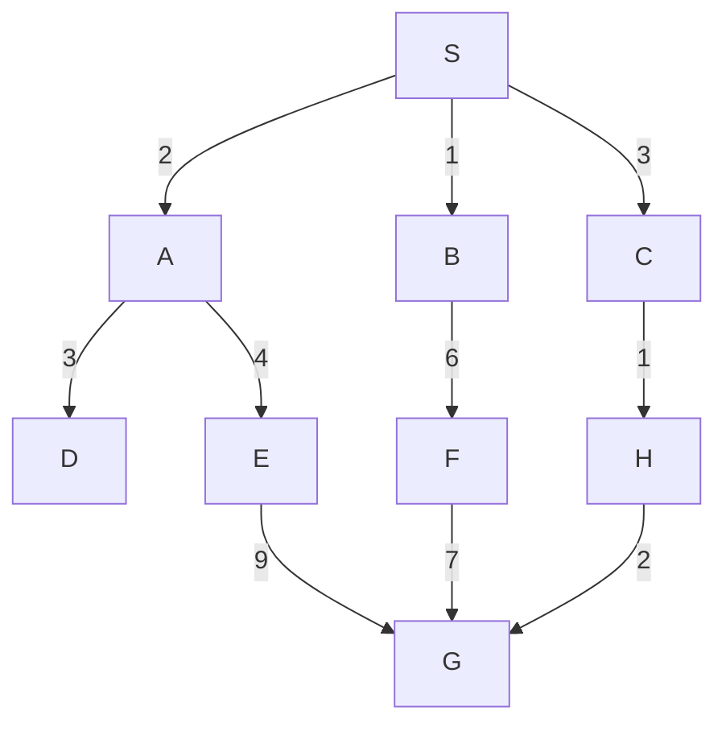

# AI Sessionals Repository

This repository contains implementations of fundamental Artificial Intelligence algorithms. It includes **Python tutorials**, **File handling in Python**, **Search Algorithms**, and **Genetic Algorithms**. Each algorithm is implemented with functionalities to handle weighted graphs, calculate path costs, and print the optimal path.

## Contents

1. **Python Basics**
   - **Python Tutorial**: Covers basic Python concepts.
   - **File Input/Output in Python**: Demonstrates reading and writing files in Python.

2. **Search Algorithms**
These algorithms are implemented to work on weighted graphs and include path cost calculation and path printing functionalities.

   - **Breadth-First Search (BFS)**
     - Explores all neighbors at the present depth before moving to nodes at the next depth level.
     - Guarantees the shortest path in an unweighted graph.

   - **Depth-First Search (DFS)**
     - Explores as far as possible along each branch before backtracking.
     - Does not guarantee the shortest path.

   - **Uniform Cost Search (UCS)**
     - A variant of BFS where the node with the lowest path cost is expanded first.
     - Guarantees the optimal solution in a weighted graph.

   - **A\* Search**
     - Uses both actual cost (g) and estimated cost (h) to find the optimal path.
     - Guarantees the shortest path if the heuristic function is admissible.

   - **Best-First Search**
     - Expands the most promising node based on a heuristic function.
     - Faster but does not always guarantee the shortest path.

   - **Depth-Limited Search (DLS)**
     - A variant of DFS with a depth limit to prevent infinite loops.

   - **Iterative Deepening Search (IDS)**
     - A combination of DFS and BFS, where depth-limited search is run iteratively with increasing depth.

3. **Genetic Algorithm (GA)**
Simulates natural selection to solve optimization problems.

   - **MaxOne Problem**
   Finds a binary string with the maximum number of ones using GA.

   - **Travelling Salesman Problem (TSP)**
   Optimizes the shortest possible route for a salesman to visit all cities once and return to the starting point.

4. **MYCIN Expert System**
   Technical Report writing on [MYCIN](https://en.wikipedia.org/wiki/Mycin) Expert System

